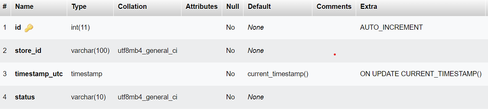
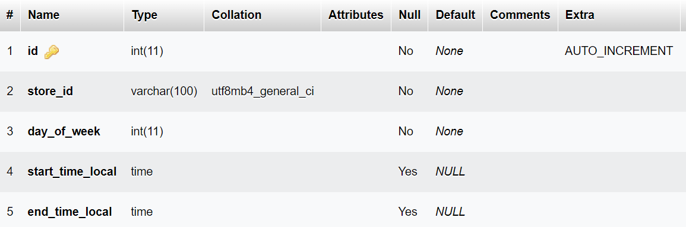
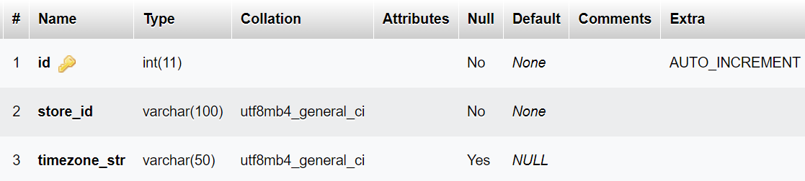
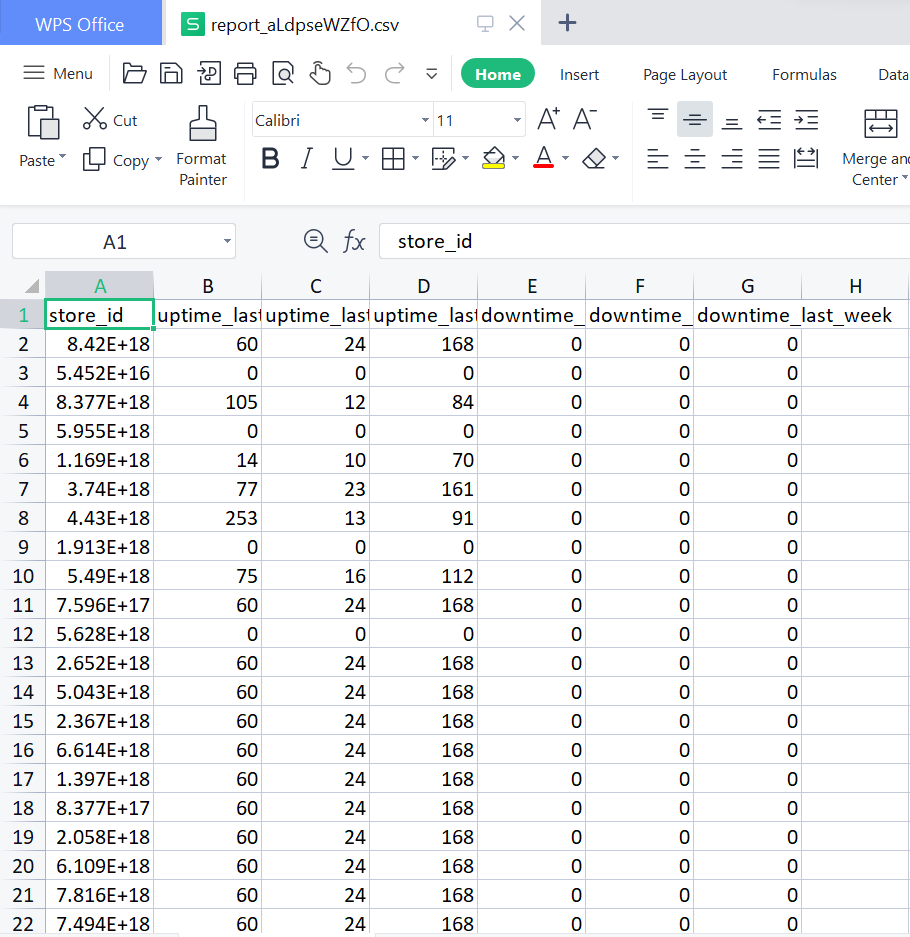

# Store Monitoring

[Problem Statement](https://loopxyz.notion.site/Take-home-interview-Store-Monitoring-12664a3c7fdf472883a41457f0c9347d)

[My Solution Demo](https://drive.google.com/file/d/1wYfWMOn9_ffxy5YUdF6zqjLHZuKA92Vc/view?usp=sharing)

The Loop Kitchen Report Generator is a Flask-based web application that generates reports based on store status and business hours data.

## Features

- Generates reports on store uptime and downtime based on store status and business hours data.
- Supports multiple store timezones and business hours configurations.
- Saves reports as CSV files for easy analysis and sharing.
- Provides RESTful API endpoints for triggering report generation and retrieving generated reports.

### Approach

01) **Data Ingestion:** Read the data from the provided CSV files and store them in MySQL database. We will create tables corresponding to each CSV file and insert the data into the tables.
i.e: add.py is a python script used to insert csv data to the SQL database.

02) **API Development:** Develop two APIs as mentioned in the requirements. The APIs will interact with the database to fetch the required data and generate the report.
i.e: app.py

03) **Report Generation Logic:** This involves calculating the uptime and downtime for each store within the specified time intervals.

04) **CSV Output:** Once the report is generated, we need to provide it as a CSV file in the required format.

### Database Design

- **store_status table:** stores the status of each store at different timestamps. It contains the following columns: **id, store_id, timestamp_utc & status**

- **store_business_hours table:** stores the business hours for each store. It contains the following columns:**id,store_id, day_of_week, start_time_local & end_time_local**

- **store_timezone table:** stores the timezone information for each store. It contains the following columns:**id, store_id & timezone_str**

- **reports table:** store the information about generated reports in the system. Here is a brief description of the table's columns:**id, report_id, status & file_path**

## Installation

1. Clone the repository to your local machine:

git clone https://github.com/apoorva-01/loop-kitchen

2. Navigate to the project directory:

cd loop-kitchen

3. Install the required dependencies using pip:

pip install -r requirements.txt

4. Set up the database connection by modifying the `SQLALCHEMY_DATABASE_URI` configuration in `app.py`. Ensure that you have a compatible MySQL database running locally or update the URI accordingly.

5. Running Flask App:

python app.py

6. Trigger Report Generation: by making a GET request to /trigger_report endpoint. Once the report generation is complete, the response will contain the report file in CSV format.

### API Endpoints

#### GET /trigger_report
This endpoint triggers the generation of a store report.

Request: No input required.

Response: 
report_id: A unique identifier for the triggered report.

#### GET /get_report?report_id={report_id}
This endpoint retrieves the status of a report or the CSV file.

Request
report_id: The report ID obtained from the /trigger_report response.
Response
If the report generation is not complete:

"status": "Running"
If the report generation is complete:

"status": "Complete"
The CSV file containing the store report data.

Final Generated Report

## Author

- [Resume](https://apoorva.igscs.in/)

- [Linkedin](https://www.linkedin.com/in/apoorva0510)

- [Github](https://github.com/apoorva-01)

